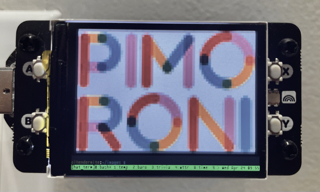
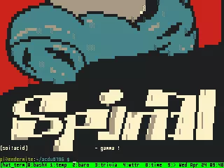

# hat_term

This is a Pi Zero W 2 and the Pimoroni [Display HAT Mini](https://shop.pimoroni.com/products/display-hat-mini?variant=39496084717651) running hat_term.



## What is it?

* terminal emulator supporting 16, 256 and 24bit colors of foreground/background, underline, reverse and bold
* [miniwi](https://github.com/josuah/miniwi) BDF font (with a few additional custom qrcode glyphs) supporting line drawing characters, drawille
* qrunicode utility to display "high resolution" codes using custom glyphs
* runs tmux, used to connect to a session to remote control the display
* use simple shell scripts to output whatever you like
* 80 columns * 30 rows on a 1.3" on the Pimoroni [Display HAT Mini](https://shop.pimoroni.com/products/display-hat-mini?variant=39496084717651)
* buttons switch tmux window

## Examples





## Prerequisites

```bash
apt install tmux
pip install -r requirements.txt
```


## How to run

Includes a systemd service file to connect the display to tmux. Make sure you edit `hat_term.service` to point to `hat_term.py`. It also includes a terminfo file to help with ensuring 24bit colours work.

```bash
tic hat_term.ti
sudo cp hat_term.service /etc/systemd/system
sudo systemctl enable hat_term.service
systemctl start hat_term.service
```


## Connect to console for keyboard use

Include this in your `.bashrc` to autorun `tmux` on login and relaunch if it gets disconnected.

```bash
if [[ $(tty) == "/dev/tty1" ]] && [[ -z "$TMUX" ]]; then 
        while true; do      
             tmux new-session -A -s "hat_term"
        done         
fi        
```

Then get the pi to auto login the `pi` user via `raspi-config`

```
Choose option 3: Boot Options
Choose option B2: Console Autologin
Select Finish, and reboot the Raspberry Pi.
```

This will start a session running in the console tty, so that a keyboard and display connected to HDMI will control and mirror hat_term.

## Terminal tweaks


For 24bit color support, you'll need this in your `.tmux.conf`:

```
set -g default-terminal "hat_term"
set -g window-size smallest
set-option -ga terminal-overrides ",hat_term:Tc"
```


## hat_term.py

Manually run it with `./hat_term.py`. Then connect to the `tmux` session with `tmux new-session -A -s "hat_term"`

## theme.json

Color definitions, default is set to [gruvbox](https://github.com/morhetz/gruvbox).

## qrunicode

A forked version on the excellent [miniwi](https://github.com/josuah/miniwi) font is included. It includes custom glyphs that are in the unused ee00:eeff range of unicode. `qrunicode` converts a qrcode matrix to these glyphs to fit more bits on the screen than the traditional block/half block glyphs.


### Requirements
```bash
pip install qrcode
```

### Usage
```
usage: qrunicode.py [-h] [--reverse] [FILE [FILE ...]]

Print qrcodes using custom miniwi-qrunicode BDF font

positional arguments:
  FILE        files to read, if empty, stdin is used

optional arguments:
  -h, --help  show this help message and exit
  --reverse   reverse qrcode colors
```
